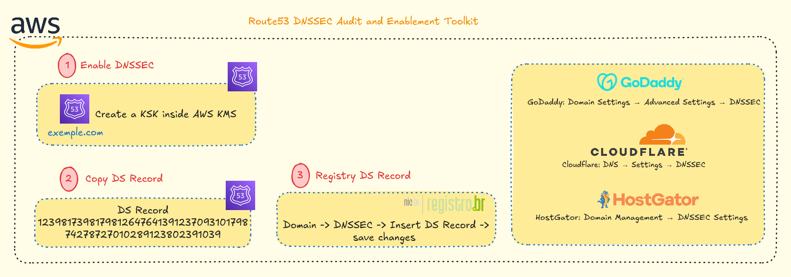

# Route53 DNSSEC Audit and Enablement Toolkit

<div align="center">
  


## Strengthen DNS Security Across Multi-Account AWS Environments

**Updated: December 2, 2025**

[](https://github.com/nicoleepaixao)
[](https://github.com/nicoleepaixao/route53-dnssec-audit)

</div>

---

<p align="center">
  
</p>

## **Overview**

This repository provides a complete toolkit for auditing DNS zones across multiple AWS accounts and enabling DNSSEC for all eligible public Route 53 hosted zones. The toolkit includes automated inventory scripts, DNSSEC eligibility assessment, registrar verification, and comprehensive operational guides for safe DNSSEC deployment.

---

## **Important Information**

### **What This Toolkit Does**

| **Aspect** | **Details** |
|------------|-------------|
| **Inventory Automation** | Enumerates all Route 53 hosted zones across accounts |
| **Zone Classification** | Detects public vs private zones automatically |
| **DNSSEC Status** | Retrieves current signing status (signed/unsigned/unsupported) |
| **Registrar Detection** | Identifies Route53 vs external registrar domains |
| **Export Format** | CSV report with detailed analysis |
| **Operation Mode** | Read-only, zero-impact on existing infrastructure |

### **Why DNSSEC Matters**

DNSSEC (Domain Name System Security Extensions) adds cryptographic signatures to DNS records, preventing:

- **Cache Poisoning**: Malicious DNS record injection
- **Man-in-the-Middle Attacks**: DNS query interception
- **DNS Spoofing**: Fraudulent DNS responses
- **Domain Hijacking**: Unauthorized domain takeovers

### **Solution Benefits**

- **Multi-Account Support**: Scan all AWS accounts from a single script
- **External Registrar Compatible**: Works with Registro.br, GoDaddy, Cloudflare, and more
- **Zero Risk**: Read-only operations, no modifications
- **Comprehensive Reports**: CSV export ready for security audits
- **Production Ready**: Full enablement guide included

---

## **How It Works**

### **Process Flow**

1. **Authentication:** Connect to AWS accounts using configured profiles
2. **Discovery:** Enumerate all Route 53 hosted zones
3. **Classification:** Identify public vs private zones
4. **Status Check:** Retrieve current DNSSEC signing status
5. **Registrar Detection:** Determine if domain is in Route53 or external registrar
6. **Export:** Generate CSV report with complete analysis

### **DNSSEC Protection**

Route 53 supports managed DNSSEC signing, where AWS handles:

- **Key Creation**: Automatic KSK (Key Signing Key) and ZSK (Zone Signing Key)
- **Key Lifecycle**: Automated rotation and management
- **Rollover**: Seamless key updates
- **Record Signing**: Cryptographic signatures for all DNS records

**Important:** The domain registrar must support DNSSEC DS records. For `.br` domains (Registro.br), this is fully supported.

---

## **Available Components**

<div align="center">

| **Component** | **Purpose** | **Format** |
|:-------------:|:-----------:|:----------:|
| **Inventory Script** | Automated zone scanning | Python 3.x |
| **CSV Report** | Detailed analysis export | CSV |
| **Enablement Guide** | Step-by-step DNSSEC setup | Markdown |
| **Troubleshooting Doc** | Common issues & solutions | Markdown |

</div>

---

## **How to Get Started**

### **1. Clone Repository**

```bash
git clone https://github.com/nicoleepaixao/route53-dnssec-audit-and-enablement.git
cd route53-dnssec-audit-and-enablement
```

### **2. Install Dependencies**

```bash
pip install -r src/requirements.txt
```

**requirements.txt:**
```text
boto3
botocore
```

### **3. Configure AWS Profiles**

Ensure your AWS profiles are configured in `~/.aws/config`:

```ini
[profile pamcard-dev]
region = us-east-1

[profile roadcard]
region = us-east-1

[profile pamcard-predev]
region = us-east-1
```

### **4. Run Inventory Script**

```bash
cd src/
python3 route53_dnssec_inventory.py
```

**Output:** `output/route53_dnssec_inventory.csv`

**Note:** The script performs read-only operations and does not modify any Route 53 settings.

---

## **Running the Inventory**

1. **Execute Script:** Navigate to `src/` directory and run the Python script
   ```bash
   python3 route53_dnssec_inventory.py
   ```

2. **Monitor Progress:** Script will scan all configured AWS profiles

3. **Review Output:** CSV file generated in `output/` directory

4. **Analyze Results:** Open CSV in Excel or any spreadsheet tool

5. **Plan Enablement:** Identify zones with `UNSIGNED` status for DNSSEC deployment

---

## **Understanding the Output**

### **CSV Report Structure**

| profile     | account_id | hosted_zone_id | domain_name            | zone_type | registered_in_route53 | dnssec_status                 |
|-------------|-------------|----------------|-------------------------|-----------|------------------------|-------------------------------|
| prod        | 111111111111 | ZABC123XYZ001  | api.company.com         | PUBLIC    | NO                     | UNSIGNED                      |
| staging     | 222222222222 | ZXYZ987ABC002  | staging.company.com     | PUBLIC    | NO                     | UNSIGNED                      |
| dev         | 333333333333 | ZAAA111BBB003  | dev.company.internal    | PRIVATE   | NO                     | NOT_SUPPORTED_PRIVATE_ZONE    |
| qa          | 444444444444 | Z456XYZ123444  | qa.company.com          | PUBLIC    | NO                     | NOT_CONFIGURED                |
| network     | 555555555555 | ZNET123ZONE55  | corpnet.internal.local  | PRIVATE   | NO                     | NOT_SUPPORTED_PRIVATE_ZONE    |

### **Field Descriptions**

| **Field** | **Description** |
|-----------|----------------|
| **profile** | AWS CLI profile used for scanning |
| **account_id** | AWS account identifier |
| **hosted_zone_id** | Route 53 hosted zone ID |
| **domain_name** | Fully qualified domain name |
| **zone_type** | PUBLIC (eligible) or PRIVATE (not supported) |
| **registered_in_route53** | YES if domain registered in Route53 Domains |
| **dnssec_status** | SIGNED, UNSIGNED, or NOT_SUPPORTED_PRIVATE_ZONE |

### **DNSSEC Eligibility**

- **Public zones** → Eligible for DNSSEC
- **Private zones** → Explicitly not supported
- **External registrar domains** → Require DS record configuration at registrar

---

## **DNSSEC Enablement Guide**

### **Step 1: Identify Eligible Zones**

Filter the CSV report for:

- `zone_type == PUBLIC`
- `dnssec_status == UNSIGNED`

These zones are DNSSEC-eligible and ready for enablement.

### **Step 2: Enable DNSSEC Signing in Route 53**

1. **AWS Console** → Route 53 → Hosted Zones → Select your domain
2. Navigate to: **DNSSEC signing** → **Enable DNSSEC**
3. AWS will automatically:
   - Enable route-53-managed key signing
   - Create a KSK inside AWS KMS
   - Begin signing all DNS records

### **Step 3: Retrieve the DS Record**

After enabling DNSSEC:

1. Route 53 → Hosted Zone → DNSSEC → **DS Records**
2. Copy the DS record values:

```text
Key Tag: 2371
Algorithm: 13
Digest Type: 2
Digest: 48FD8DE2349F3AA3AA3C09B7E0...
```

### **Step 4: Publish DS Record at Registrar**

#### **For Registro.br Domains:**

1. Access https://registro.br
2. Select your domain
3. Navigate to **DNSSEC** section
4. Insert the DS Record values:
   - Key Tag
   - Algorithm
   - Digest Type
   - Digest
5. Save changes

#### **For Other Registrars:**

- **GoDaddy**: Domain Settings → Advanced Settings → DNSSEC
- **Cloudflare**: DNS → Settings → DNSSEC
- **HostGator**: Domain Management → DNSSEC Settings

### **Step 5: Validate DNSSEC Propagation**

**Using dig command:**

```bash
dig +dnssec yourdomain.com.br
```

Look for the `ad` flag (Authenticated Data) in the response.

**Using online validators:**

- [DNSViz](https://dnsviz.net/)
- [Verisign DNSSEC Debugger](https://dnssec-debugger.verisignlabs.com/)

**Note:** Propagation can take up to 48 hours.

---

## **Supported Registrars**

| **Registrar** | **DNSSEC Support** | **Configuration** |
|---------------|-------------------|-------------------|
| Registro.br | ✅ Full Support | Web interface with DS record input |
| GoDaddy | ✅ Full Support | Domain settings → Advanced |
| Cloudflare | ✅ Full Support | DNS settings panel |
| HostGator | ✅ Full Support | Domain management console |
| Google Domains (legacy) | ✅ Full Support | Domain settings |

---

## **Troubleshooting**

### **Common Issues**

| **Issue** | **Cause** | **Solution** |
|-----------|-----------|--------------|
| DS Record rejected | Mismatched digest type or copy error | Verify all fields match exactly |
| No AD flag returned | Propagation in progress | Wait up to 48 hours, check again |
| Private zone error | DNSSEC not supported for private zones | Only enable for public zones |
| Unsupported registrar | Registrar doesn't support DNSSEC for TLD | Contact registrar support |
| KMS permission error | IAM role lacks KMS permissions | Add `kms:CreateKey` permission |

### **Validation Commands**

```bash
# Check DNSSEC status
dig +dnssec +multi example.com

# Query specific record type
dig +dnssec example.com DNSKEY

# Check DS record at parent zone
dig +dnssec example.com DS

# Trace full DNSSEC chain
dig +dnssec +trace example.com
```

---

## **Features**

| **Feature** | **Description** |
|-------------|-----------------|
| **Multi-Account Scanning** | Enumerate zones across all AWS profiles |
| **Zone Classification** | Automatic public/private detection |
| **DNSSEC Status** | Real-time signing status retrieval |
| **Registrar Detection** | Identify Route53 vs external domains |
| **CSV Export** | Detailed report for audits and compliance |
| **Zero Impact** | Read-only, no infrastructure changes |
| **External Registrar Support** | Works with Registro.br, GoDaddy, Cloudflare |
| **Comprehensive Documentation** | Full enablement and troubleshooting guides |

---

## **Use Cases**

This toolkit is ideal for:

- **Security Audits**: Comprehensive DNSSEC compliance assessment
- **Cloud Migration**: Pre-migration DNS security baseline
- **Compliance Requirements**: Meet industry security standards (PCI-DSS, SOC 2)
- **Multi-Account Governance**: Centralized DNS security management
- **Risk Mitigation**: Prevent DNS-based attacks across all domains
- **Infrastructure Hardening**: Strengthen overall AWS security posture

---

## **Technologies Used**

| **Technology** | **Version** | **Purpose** |
|----------------|-------------|-------------|
| Python | 3.8+ | Core scripting and automation |
| boto3 | Latest | AWS SDK for Route 53 API calls |
| botocore | Latest | Low-level AWS service access |
| AWS Route 53 | - | DNS service and DNSSEC management |
| AWS KMS | - | Key management for DNSSEC signing |
| AWS CLI | Latest | Profile and credential management |

---

## **Project Structure**

```text
route53-dnssec-audit-and-enablement/
│
├── README.md                          # Complete project documentation
│
├── src/
│   ├── route53_dnssec_inventory.py   # Main inventory script
│   └── requirements.txt               # Python dependencies
│
├── output/
│   └── route53_dnssec_inventory.csv  # Auto-generated inventory report
│
├── docs/
│   ├── dnssec_enablement_guide.md    # Full DNSSEC enablement steps
│   └── troubleshooting.md            # Common issues & resolutions
│
└── .gitignore                         # Ignored files (output/, *.csv, .env)
```

---

## **Additional Information**

For more details about DNSSEC, Route 53 security, and DNS best practices, refer to:

- [AWS Route 53 DNSSEC Documentation](https://docs.aws.amazon.com/Route53/latest/DeveloperGuide/dns-configuring-dnssec.html) - Official guide
- [DNSSEC How It Works](https://www.icann.org/resources/pages/dnssec-what-is-it-why-important-2019-03-05-en) - ICANN explanation
- [Registro.br DNSSEC Guide](https://registro.br/tecnologia/dnssec.html) - Brazilian domains
- [DNSViz Visualization Tool](https://dnsviz.net/) - DNSSEC validation

---

## **Future Enhancements**

| **Feature** | **Description** | **Status** |
|-------------|-----------------|------------|
| Automated Enablement | Script to enable DNSSEC across all eligible zones | Planned |
| Multi-Region Support | Cross-region DNSSEC monitoring | In Development |
| Compliance Reports | PCI-DSS and SOC 2 compliance templates | Planned |
| Slack Notifications | Alert on DNSSEC status changes | Future |
| Terraform Module | IaC for automated DNSSEC deployment | Planned |
| Dashboard Integration | QuickSight visualization of DNSSEC coverage | Future |

---

## **Connect & Follow**

Stay updated with AWS security automation and DNS best practices:

<div align="center">

[](https://github.com/nicoleepaixao)
[](https://www.linkedin.com/in/nicolepaixao/)
[](https://medium.com/@nicoleepaixao)

</div>

---

## **Disclaimer**

This toolkit is provided for DNS security auditing and DNSSEC enablement purposes. DNSSEC configuration, registrar compatibility, and propagation times may vary. Always test DNSSEC enablement in non-production environments before deploying to production domains. Consult official AWS documentation and your domain registrar for the most current information.

---

<div align="center">

**Happy securing your DNS infrastructure!**

*Document last updated: December 5, 2025*

</div>
